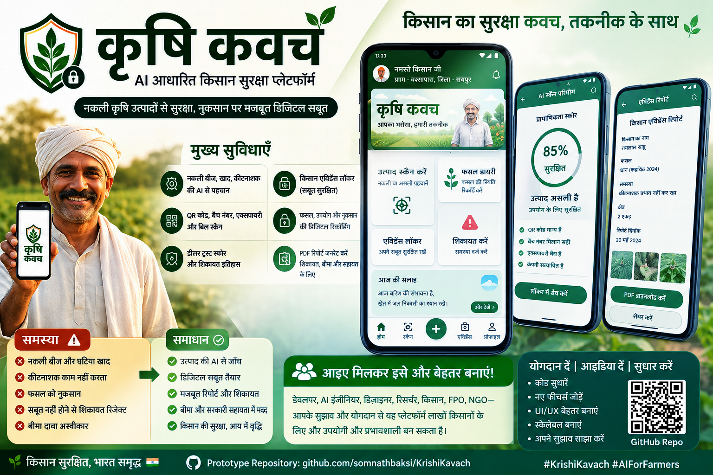

# Krishi Kavach



**Krishi Kavach** is a Hindi-first PHP + MySQL farmer protection platform for fake seed, fertilizer, and pesticide detection. It includes a farmer panel, admin panel, AI-style scan workflow, geotagged evidence locker, product photo upload, complaint report flow, and officer support directory.

## Features

- Hindi default language with English as secondary language
- Farmer authentication and profile
- Admin authentication and dashboard
- Product scan with risk level, batch number, seller, and AI summary
- Geotag capture using browser location
- Product front/back/QR/bill photo upload
- Evidence locker with image preview and file details
- Case timeline and complaint report preview
- Notifications for farmer actions and risk alerts
- Admin views for farmers, cases, scans, evidence, reports, notifications, and officers
- MySQL database seed files with dummy data

## Tech Stack

- PHP 8+
- MySQL / MariaDB
- XAMPP compatible
- HTML, CSS, JavaScript
- Lucide icons CDN

## Project Setup

1. Copy the project into:

```text
C:\xampp\htdocs\krishikavach
```

2. Start XAMPP:

- Apache
- MySQL

3. Import database in phpMyAdmin or MySQL CLI:

```bash
mysql -u root < database/schema.sql
mysql -u root < database/dummy_data.sql
mysql -u root < database/admin_seed.sql
mysql -u root < database/scan_upload_migration.sql
```

4. Open the app:

```text
http://localhost/krishikavach/
```

## Database

Database name:

```text
krishikavach
```

Default local database config:

```text
Host: localhost
Username: root
Password: blank
```

Main tables:

- `users`
- `farmer_profiles`
- `crop_profiles`
- `cases`
- `product_scans`
- `evidence_files`
- `case_events`
- `reports`
- `notifications`
- `officers`

## Login Credentials

### Farmer Panel

URL:

```text
http://localhost/krishikavach/login.php
```

Farmer login:

```text
Mobile: 9876543210
Password: password123
```

Other dummy farmer accounts use the same password:

```text
9876543211 / password123
9876543212 / password123
9876543213 / password123
```

### Admin Panel

URL:

```text
http://localhost/krishikavach/admin/login.php
```

Admin login:

```text
Mobile: 9999999999
Email: admin@krishikavach.local
Password: admin123
```

## Uploads

Evidence uploads are stored in:

```text
uploads/evidence
```

The folder contains `.gitkeep`; uploaded runtime files should not be committed in real deployments.

## Notes

- The `mobile/` prototype folder is intentionally ignored from Git upload.
- The PHP app uses shared assets from `assets/css/mobile.css` and `assets/js/mobile.js`.
- Browser geolocation requires user permission and works best on localhost or HTTPS.
- AI scan result logic is currently prototype/demo logic and can be connected to a real model/API later.

## Repository

```text
https://github.com/somnathbaksi/KrishiKavach
```
